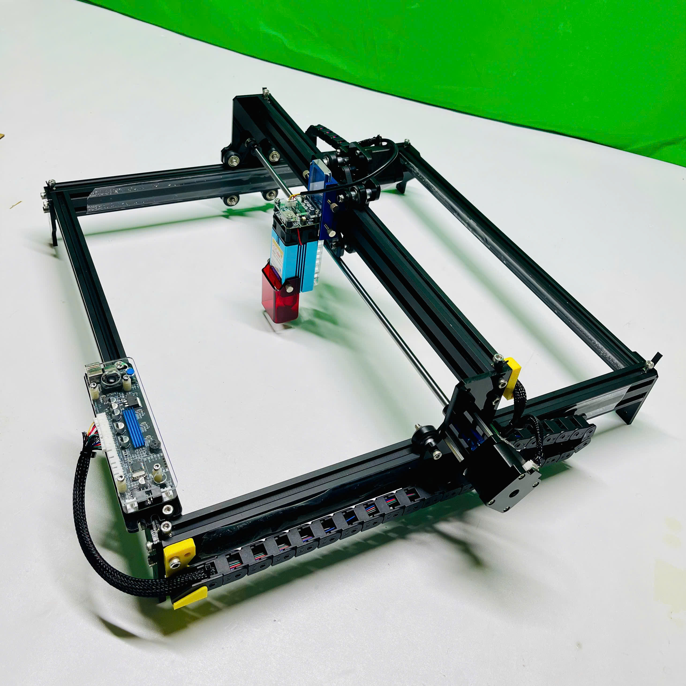
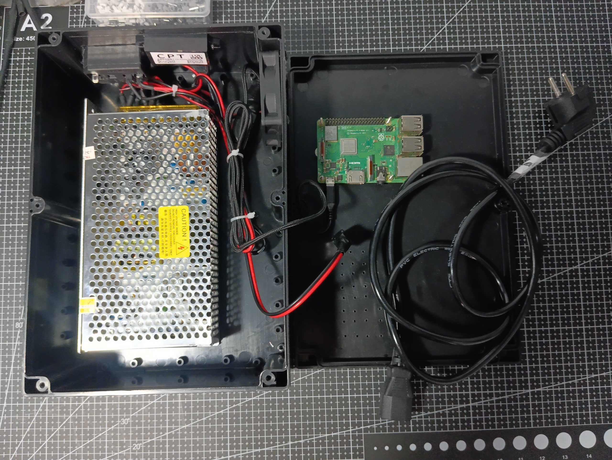

# LaserCNC Project – Laser CNC Control System with Docker


## 📋 Introduction

This project provides a complete Laser CNC control system using Docker, designed for **remote operation over WiFi**. The system includes:
- **LaserWeb**: Web-based interface for remote Laser CNC control
- **Nginx**: Reverse proxy for secure web interface access
- **WiFi Connectivity**: Full remote operation capability from any device on the network




The system is optimized for DietPi (Raspberry Pi) and provides **easy remote access** through any web browser on your network.

## 🚀 Key Features

- ✅ **Web-based remote Laser CNC control** (port 80 via Nginx, port 8080 direct)
- ✅ **WiFi connectivity** - control your CNC from any device on the network
- ✅ **Automatic service restart** after system reboot
- ✅ **Serial device access** for communication with the controller board
- ✅ **Support for multiple file formats** (G-code, SVG, DXF, etc.)
- ✅ **Ready for webcam integration** (mjpg-streamer configuration available)
- ✅ **Reverse proxy setup** for clean URL access
- ✅ **Remote monitoring** - view and control your CNC from anywhere on your network

## 🌐 WiFi & Remote Control Setup

### Prerequisites for Remote Operation
- **WiFi Network**: Stable wireless network for Raspberry Pi connectivity
- **Router Access**: For configuring port forwarding (optional, for external access)
- **Connect Raspberry Pi to WiFi**:
   ```bash
   # Edit WiFi configuration on DietPi
   sudo dietpi-config
   ```
   Navigate to: **Network Options → WiFi** and connect to your network.


### Remote Access Methods

#### **Local Network Access**
- **Via Nginx**: `http://[RASPBERRY-PI-IP]` (port 80)
- **Direct LaserWeb**: `http://[RASPBERRY-PI-IP]:8080` (port 8080)
- **Webcam Stream**: `http://[RASPBERRY-PI-IP]:8081` (if enabled)

#### **External Network Access (Advanced)**
1. **Configure Port Forwarding** on your router:
   - Forward port 80 to your Raspberry Pi's IP address
   - **Security Note**: Consider using VPN or SSH tunnel for secure external access

2. **Dynamic DNS** (for changing public IP):
   - Use services like DuckDNS or No-IP
   - Update your router or Raspberry Pi with DDNS client

## 🛠️ System Requirements

- **Operating System**: DietPi (recommended) with WiFi capability
- **Docker**: Latest version
- **Docker Compose**: Latest version
- **Network**: Stable WiFi connection
- **Hardware**:
  - Raspberry Pi 3/4/5 (recommended) with WiFi
  - Linux-compatible USB webcam (optional)
  - Laser CNC controller board (GRBL, Marlin, Smoothieware, etc.)
  - Serial/USB connection to the controller board

## 📦 Installation

### 1. Installation the services

```bash
# Grant execute permission
chmod +x install.sh

# Run the installation script (requires root privileges)
sudo ./install.sh
```

The `install.sh` script will:

1. Update the DietPi system and install necessary tools
2. Install Docker and Docker Compose via dietpi-software
3. Add the current user to the docker group
4. Start the Docker service
5. Stop any existing containers (clean start)

### 2. Start the services

After installation, start the services with:

```bash
docker compose up -d
```

### 3. Access the interfaces remotely

Once your Raspberry Pi is connected to WiFi:

* **LaserWeb via Nginx**: `http://[RASPBERRY-PI-IP]` (port 80)
* **LaserWeb direct**: `http://[RASPBERRY-PI-IP]:8080` (port 8080)
* **Webcam Stream**: Not enabled by default (see configuration section below)

### 4. Connection Configuration

1. **Connect the Laser CNC controller board**:

   * Connect the board via USB/serial
   * Check device path: `ls /dev/tty*` or `ls /dev/serial*`
   * In LaserWeb, select the correct serial port and baud rate (usually 115200)

2. **Configure the webcam (optional)**:

   * Uncomment the `mjpg-streamer` section in `docker-compose.yaml`
   * Update the device path if needed: `/dev/video0:/dev/video0`
   * Also uncomment the webcam proxy section in `nginx.conf`
   * Restart services: `docker compose up -d`

## 🎥 Webcam Integration (Optional)

### Enabling Webcam Streaming for Remote Monitoring

The system includes a pre-configured **mjpg-streamer** service for remote visual monitoring. To enable it:

1. **Uncomment the mjpg-streamer service** in `docker-compose.yaml`
2. **Uncomment the webcam proxy section** in `nginx.conf`
3. **Restart the services**:

```bash
docker compose down
docker compose up -d
```

### Webcam Stream Configuration for Remote Viewing

The default mjpg-streamer configuration includes:

* **Resolution**: 1280x720
* **Frame rate**: 30 FPS
* **Rotation**: 90 degrees (adjust as needed)
* **Port**: 8081 (accessible via `http://[RASPBERRY-PI-IP]:8081`)

#### Customize video streaming (in `docker-compose.yaml`):

Modify the command parameters in the mjpg-streamer service:
- Change `-r 1280x720` for different resolution
- Change `-f 30` for different frame rate
- Change `-rot 90` for different rotation (0, 90, 180, 270)

### Access the webcam stream remotely

Once enabled:
* **Direct access**: `http://[RASPBERRY-PI-IP]:8081`
* **Via Nginx**: `http://[RASPBERRY-PI-IP]/cam/` (if proxy configured)

## 📚 References

* [LaserWeb GitHub](https://github.com/LaserWeb/LaserWeb4) – LaserWeb documentation
* [mjpg-streamer GitHub](https://github.com/jacksonliam/mjpg-streamer) – mjpg-streamer documentation
* [Docker Documentation](https://docs.docker.com/) – Docker official docs
* [Nginx Documentation](https://nginx.org/en/docs/) – Nginx configuration
* [GRBL GitHub](https://github.com/gnea/grbl) – GRBL firmware for CNC
* [DietPi OS](https://github.com/MichaIng/DietPi) – Lightweight justice for your single-board computer
* [Raspberry Pi WiFi Configuration](https://www.raspberrypi.com/documentation/computers/configuration.html#wireless-networking) – Official WiFi setup guide

## 📄 License

This project is distributed under the MIT License. See the `LICENSE` file for more details.

## 🙏 Acknowledgements

Thanks to the open-source projects:

* [LaserWeb](https://github.com/LaserWeb/LaserWeb4) – Web interface for Laser CNC control
* [mjpg-streamer](https://github.com/jacksonliam/mjpg-streamer) – Webcam video streaming
* [Nginx](https://nginx.org/) – Web server and reverse proxy
* [Docker](https://www.docker.com/) – Container platform
* [DietPi OS](https://github.com/MichaIng/DietPi) – Lightweight justice for your single-board computer
---

**🔄 Last update**: 19/01/2026
**✨ Focus**: Enhanced WiFi connectivity and remote control capabilities